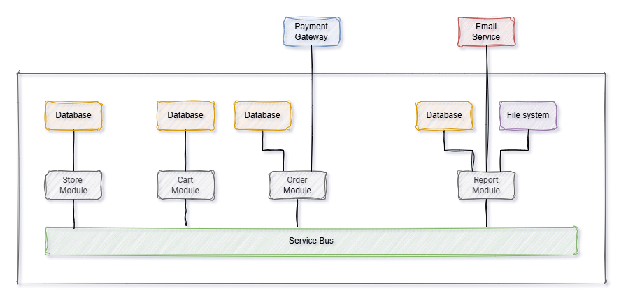

```
 ___          _     ___       _ _          ___ _                  _           ___              _        
| _ ) __ _ __(_)__ / _ \ _ _ | (_)_ _  ___/ __| |_  ___ _ __ _ __(_)_ _  __ _/ __| ___ _ ___ _(_)__ ___ 
| _ \/ _` (_-< / _| (_) | ' \| | | ' \/ -_)__ \ ' \/ _ \ '_ \ '_ \ | ' \/ _` \__ \/ -_) '_\ V / / _/ -_)
|___/\__,_/__/_\__|\___/|_||_|_|_|_||_\___|___/_||_\___/ .__/ .__/_|_||_\__, |___/\___|_|  \_/|_\__\___|
                                                       |_|  |_|         |___/                           
```

- The repository was created to demonstrate a sample architecture for a simple online shop.
- The system itself is divided into modules, which only communicate with each other via a data bus.
- Each module is responsible for its own data and does not have access to the data of other modules.
- This approach will make it easier to split the modules into separate services in the future, if necessary. In the
  initial stage, it is easier to manage one service than several.

# Architecture



# Modules

## Product Module

Responsible for managing the products. Provides simple CRUD operations for products.

### Functionalities

- ✅ Get all products
- ✅ Get a product by id
- ✅ Create a product
- ✅ Update a product
- ✅ Delete a product

### Dependencies

- ✅ Mongo Db - data persistence
- ✅ Service Bus - communication with other modules

### How can be improved?

- Add partial update for products that use PATCH and JsonPatchDocument
- Add a pagination and filtering for the get all products endpoint
- Add a search endpoint for products

---

## Cart Module

Responsible for managing the cart of a user.

### Functionalities

- ✅ Create a cart
- ✅ Get the cart with all the products
- ❌ Add a product to the cart
- ❌ Remove a product from the cart

### Dependencies

- ✅ Mongo Db - data persistence
- ✅ Service Bus - communication with other modules

---

## Order Module

Responsible for managing the orders of a user.

### Functionalities

- ❌ Create an order
- ❌ Handle payment

### Dependencies

- ❌ Mongo Db - data persistence
- ❌ Service Bus - communication with other modules
- ❌ Payment Gateway

---

## Report Module

Responsible for generating reports. Currently, reports are generated by BackgroundService.

### Functionalities
 
- ❌ Generate monthly reports
- ❌ Mongo Db - data persistence
- ❌ Service Bus - communication with other modules
- ❌ Email Service

### How can be improved?

- Move the report generation to a separate CRON job service. It may be serverless solution (Azure Function, AWZ Lambda
  etc.) or a k8s CronJob.

## General improvements

- **TESTS**
- Add logging
- Add caching (ETags, Redis)
- Authorization and authentication
- Contracts should be placed in a separate project to avoid circular dependencies

